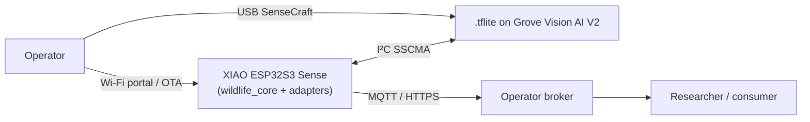

# Wildlife Spotter — XIAO ESP32S3 Sense + Grove Vision AI V2

[](https://github.com/ianshank/Ardurino/actions/workflows/ci.yml)
[](LICENSE)

Battery/solar wildlife identification node. The Grove Vision AI V2 runs a
SenseCraft-flashed TinyML model and streams detections over I²C (SSCMA).
The XIAO ESP32S3 Sense forwards them — and optional JPEG snapshots — to a
configurable MQTT broker (or HTTP blob endpoint). All tunables live in
versioned JSON on LittleFS, provisioned via Wi-Fi captive portal.

---

## Table of contents

- [Architecture](#architecture)
- [Hardware](#hardware)
- [Repository layout](#repository-layout)
- [Quick start](#quick-start)
- [Tests &amp; coverage](#tests--coverage)
- [Operations &amp; runbooks](#operations--runbooks)
- [Troubleshooting](#troubleshooting)
- [Roadmap / next steps](#roadmap--next-steps)
- [Contributing](#contributing)
- [License](#license)

## Architecture

The system follows a hexagonal / ports-and-adapters layout, documented as
a [C4 model](https://c4model.com/):

| Level                   | Document                                                              |
|-------------------------|-----------------------------------------------------------------------|
| 1 — System Context      | [docs/architecture/c4-context.md](docs/architecture/c4-context.md)    |
| 2 — Containers          | [docs/architecture/c4-container.md](docs/architecture/c4-container.md)|
| 3 — Components          | [docs/architecture/c4-component.md](docs/architecture/c4-component.md)|



## Hardware

| Component                | Notes                                                        |
|--------------------------|--------------------------------------------------------------|
| Seeed XIAO ESP32S3 Sense | ESP32-S3, PSRAM, OPI flash, USB-CDC                          |
| Seeed Grove Vision AI V2 | Himax HX6538, on-sensor TinyML, USB-CDC + I²C                |
| I²C wiring               | XIAO `SDA` / `SCL` → Grove `SDA` / `SCL`, common GND         |
| Power                    | Battery + solar (LiPo) or 5 V USB                            |

## Repository layout

```text
src/                          composition root (Arduino)
  camera_web_server/          Seeed camera-web-server adaptation
lib/wildlife_core/            pure C++ logic, host-buildable, no Arduino deps
lib/wildlife_adapters/        Arduino/ESP-specific shims
test/native/                  Unity host tests (172 cases / 15 suites)
data/                         LittleFS image: config + labels
partitions/                   ESP32 partition tables (dual-OTA + dev)
tools/                        coverage runner, helper scripts, flash verifier
docs/
  architecture/               C4 context / container / component
  runbooks/                   how-to procedures (e.g. flashing the Grove)
  operations/                 day-2 ops (smoke test, deployment)
  testing/                    regression plan
.github/                      CI workflows + PR / issue templates
```

## Quick start

### Prerequisites

- Python 3.12+
- [PlatformIO Core](https://docs.platformio.org/) ≥ 6.1.15 (CI-pinned; 6.7+ supported locally)
- (Optional) `clang-format` 18+, `ruff`, `gcovr`

### Build &amp; flash

```powershell
python -m venv .venv
.\.venv\Scripts\Activate.ps1
pip install -U platformio gcovr ruff

# Production firmware (dual-OTA + LittleFS)
pio run -e xiao_esp32s3_sense -t upload

# Fast-flash dev iteration (no OTA)
pio run -e xiao_esp32s3_sense_dev -t upload

# Camera web-server variant (Seeed adaptation, requires Wi-Fi creds)
$env:CAMERA_WIFI_SSID = "<ssid>"
$env:CAMERA_WIFI_PASSWORD = "<password>"
$env:CAMERA_FALLBACK_AP_PASS = "<strong-fallback-ap-password>"
pio run -e xiao_esp32s3_camera_web -t upload

# Direct MJPEG smoke variant. This bypasses Grove hardware and injects
# synthetic JPEG frames into /stream/frame; it does not emulate the stock UI.
pio run -e xiao_esp32s3_camera_web_fake -t upload
tools/check_grove_streaming.ps1 -Host <device-ip> -Seconds 3 -MinFrames 3
```

### Provision

1. On first boot, connect to AP `WSPOT-Setup`, follow the captive portal.
2. Enter Wi-Fi credentials and your MQTT broker URL.
3. The node reboots, joins Wi-Fi, and begins publishing to
   `wildlife/<node-id>/event`.

### Flash a model to the Grove (PC only)

The Grove Vision AI V2's `.tflite` model is flashed separately, via USB,
using the SenseCraft Web Toolkit. The full PC-only procedure (no mobile
app required) and recovery instructions are in
[docs/runbooks/grove-model-flash-pc.md](docs/runbooks/grove-model-flash-pc.md).

For dev/CI smoke testing of the XIAO HTTP MJPEG path without Grove hardware,
use `xiao_esp32s3_camera_web_fake` and verify direct `/stream/frame` output
with `tools/check_grove_streaming.ps1`. The fake env is not a production image
and does not emulate the web UI's Start command path.

After flashing, verify with:

```powershell
python tools/grove_flash_check.py COM11   # exit 0 = ready, 2 = descriptor-only
```

## Tests &amp; coverage

```powershell
# All native unit tests (currently 172 / 172 green)
pio test -e native

# Coverage gate (>=84% line, >=67% branch on wildlife_core)
pwsh tools/coverage.ps1
```

Full regression checklist (CI + hardware-in-the-loop):
[docs/testing/regression-plan.md](docs/testing/regression-plan.md).

## Operations &amp; runbooks

- End-to-end smoke test:
  [docs/operations/smoke-test.md](docs/operations/smoke-test.md)
- Grove model flashing (PC only):
  [docs/runbooks/grove-model-flash-pc.md](docs/runbooks/grove-model-flash-pc.md)

## Troubleshooting

| Symptom                                                             | Likely cause                                                                  |
|---------------------------------------------------------------------|-------------------------------------------------------------------------------|
| `AT+MODELS?` returns `size: 0`                                      | Descriptor-only flash. Re-flash following the Grove runbook.                  |
| `:8080/stream/frame` times out                                      | No model loaded → SSCMA never raises an INVOKE. Fix `MODELS?` first.          |
| Need HTTP stream smoke without Grove hardware                       | Build `xiao_esp32s3_camera_web_fake`; test direct `/stream/frame` only.       |
| XIAO not on expected IP                                             | DHCP rotation; sweep LAN by MAC `e0:72:a1:f8:77:9c` (see smoke-test runbook). |
| `pio test -e native` link errors                                    | Stale `.pio/build/native`. Run `pio run --target clean -e native` and retry.  |
| `xiao_esp32s3_camera_web` build pulls Eigen into other envs         | `lib_deps` leak. Verify `lib_deps` is scoped to that env only.                |

## Roadmap / next steps

- [ ] **Unblock H-05** — finish a clean PC flash so `AT+MODELS?` reports
  `size > 0`; re-run end-to-end smoke (`docs/operations/smoke-test.md`).
- [ ] Wire MQTT publishing through `wildlife_adapters/mqtt_transport` end
  to end on hardware (currently host-tested only).
- [ ] Add OTA happy-path bench test (currently host-only via
  `test_state_machine_ota`).
- [ ] LittleFS config hot-reload (today requires reboot).
- [ ] Add `pio check` to CI for the camera-web env.
- [ ] Persist a small ring buffer of detections to LittleFS for offline
  resilience.
- [ ] Field-deployment guide (solar panel sizing, enclosure, antenna).

See also [CHANGELOG.md](CHANGELOG.md) for the change history.

## Contributing

See [CONTRIBUTING.md](CONTRIBUTING.md) for branch naming, pre-PR checks,
and commit conventions. Security reports: [SECURITY.md](SECURITY.md).

## License

[MIT](LICENSE) — see file for full text.
