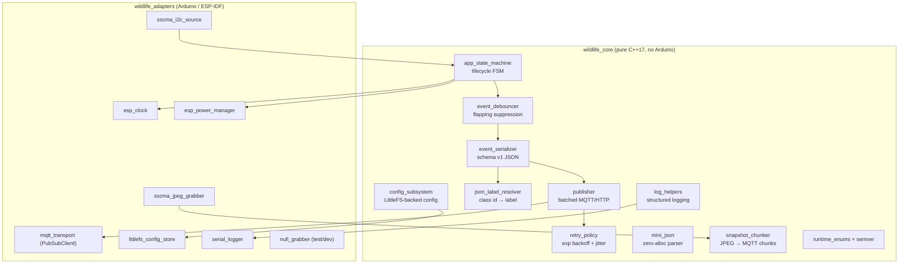

# C4 Level 3 — Components

Components inside `lib/wildlife_core/` (pure C++, host-buildable, 100 %
covered by Unity tests in `test/native/`) and `lib/wildlife_adapters/`
(Arduino/ESP-specific shims, validated by the hardware regression plan).

## Component responsibilities

### Core (`lib/wildlife_core/`)

| Component                | Purpose                                                              |
|--------------------------|----------------------------------------------------------------------|
| `app_state_machine`      | Boot → idle → detect → publish → sleep FSM with OTA hooks           |
| `event_debouncer`        | Drops redundant detections within configured window                  |
| `event_serializer`       | Renders `event.v1.schema.json`-compliant JSON                        |
| `publisher`              | Batches events, integrates retry, calls transport adapter            |
| `retry_policy`           | Exponential backoff with full jitter + max-attempt cap               |
| `json_label_resolver`    | Maps class id → human label using `data/labels.json`                 |
| `config_subsystem`       | Load/validate config from LittleFS, fall back to defaults            |
| `log_helpers`            | Structured log lines, level filtering                                |
| `mini_json`              | Minimal allocator-free JSON parser for embedded                      |
| `snapshot_chunker`       | Splits a JPEG into size-bounded MQTT payload chunks                  |
| `runtime_enums`/`semver` | Domain enums; semver comparator for OTA rollback decisions          |

### Adapters (`lib/wildlife_adapters/`)

| Adapter                  | Hardware/OS surface                                                  |
|--------------------------|----------------------------------------------------------------------|
| `sscma_i2c_source`       | Pulls inference results from Grove via Seeed_Arduino_SSCMA           |
| `sscma_jpeg_grabber`     | Pulls JPEG frame buffer from Grove                                   |
| `mqtt_transport`         | PubSubClient wrapper, TLS optional                                   |
| `littlefs_config_store`  | Reads `data/config.default.json` from LittleFS                       |
| `esp_clock`              | Monotonic millis, NTP sync                                           |
| `esp_power_manager`      | Light/deep sleep, brownout policy                                    |
| `serial_logger`          | UART backend for `log_helpers`                                       |
| `null_grabber`           | Test/dev double                                                      |

## Test coverage

Each core component has a dedicated Unity suite under `test/native/`:

- `test_state_machine`, `test_state_machine_ota`, `test_debouncer`,
  `test_serializer`, `test_publisher`, `test_retry_policy`, `test_labels`,
  `test_config`, `test_log_helpers`, `test_json`, `test_chunker`,
  `test_runtime_enums`, `test_semver`, `test_inference_filter`.
- Adapter sanity is exercised host-side by `test_adapters_host`.
- 171 cases / 15 suites currently green.
