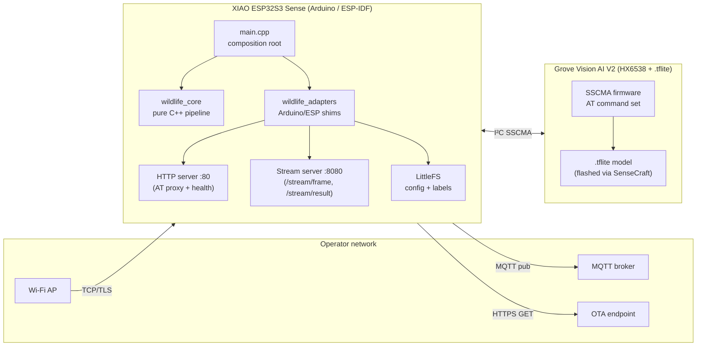

# C4 Level 2 — Containers

Inside the Wildlife Spotter node, two physical boards cooperate over I²C.
The XIAO ESP32S3 Sense is the *control plane* and *network gateway*; the
Grove Vision AI V2 is the *inference plane*.

## Containers

| Container             | Tech                       | Responsibility                                  |
|-----------------------|----------------------------|-------------------------------------------------|
| `src/main.cpp`        | Arduino                    | Composition root, scheduler, lifecycle          |
| `wildlife_core`       | C++17, host-buildable      | State machine, debouncing, serialization, retry |
| `wildlife_adapters`   | Arduino + ESP-IDF          | Wi-Fi, MQTT, I²C, LittleFS, clock, power, log   |
| HTTP control :80      | WebServer (Arduino)        | Health, AT proxy for diagnostics                |
| Stream server :8080   | WebServer (Arduino)        | `/stream/frame` (JPEG), `/stream/result` (JSON) |
| Grove SSCMA           | HX6538 firmware            | TinyML inference, JPEG frame grabber            |
| LittleFS partition    | LittleFS                   | `config.default.json`, `labels.json`            |

## Hosting variants

| PlatformIO env             | Partition table               | Purpose                              |
|----------------------------|-------------------------------|--------------------------------------|
| `xiao_esp32s3_sense`       | `dual_ota_littlefs.csv`       | Production: dual-OTA + rollback      |
| `xiao_esp32s3_sense_dev`   | `single_app_dev.csv`          | Fast-flash dev iteration             |
| `xiao_esp32s3_camera_web`  | `single_app_dev.csv`          | Seeed camera-web-server adaptation   |
| `native`                   | n/a (host gcc)                | Unity tests + gcovr coverage gate    |

See [c4-component.md](c4-component.md) for a breakdown of `wildlife_core`.
