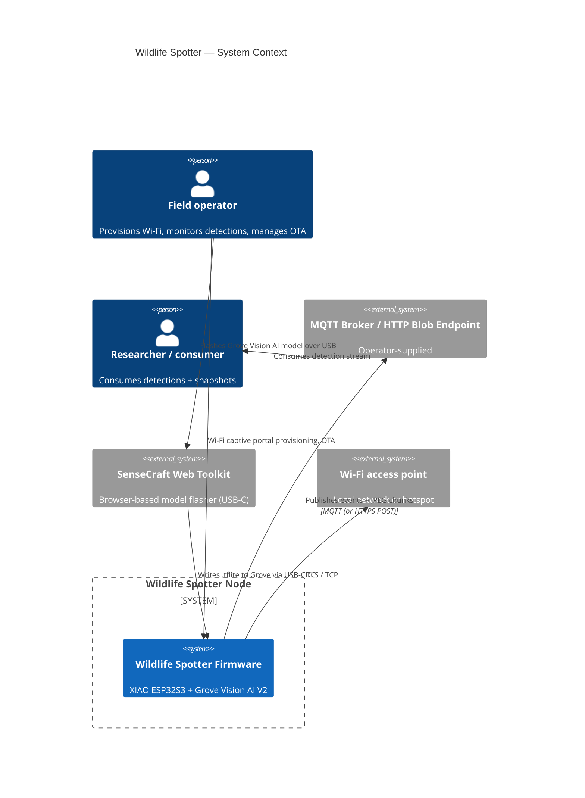

# C4 Level 1 — System Context

Wildlife Spotter is an autonomous, battery/solar-powered wildlife
identification node. It pairs a Seeed XIAO ESP32S3 Sense (compute + Wi-Fi)
with a Grove Vision AI V2 (on-sensor TinyML inference) and forwards
detections to an operator-supplied backend.

## Key external interfaces

| Interface              | Direction | Protocol            | Notes                                |
|------------------------|-----------|---------------------|--------------------------------------|
| Wi-Fi captive portal   | inbound   | HTTP (AP mode)      | First-boot provisioning via WiFiManager |
| MQTT broker            | outbound  | MQTT 3.1.1 / TLS    | Event + chunked JPEG publishing      |
| HTTP blob endpoint     | outbound  | HTTPS POST          | Optional snapshot fallback           |
| OTA endpoint           | inbound   | HTTPS GET           | Dual-OTA partition with rollback     |
| SenseCraft Web Toolkit | inbound   | USB-CDC (serial)    | One-time model flashing to Grove     |
| AT proxy (debug)       | inbound   | HTTP `:80/command`  | Base64-wrapped AT+ commands to Grove |

See [c4-container.md](c4-container.md) for the next level of detail.
